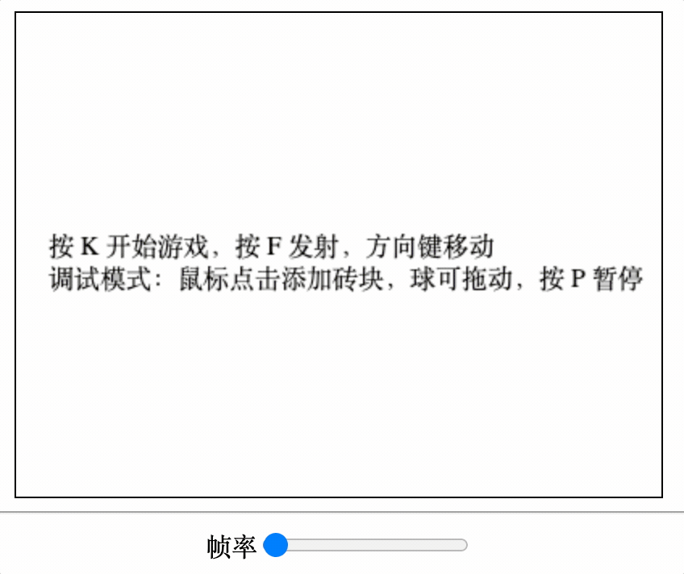

# game-framework
Object-oriented game framework in JavaScript

## Feature

- Real time game config changes
- Particle System
- Scene management (title scene, main scene, end scene)
- Sprite management
- Key-binding management

## Screenshots

***

***

